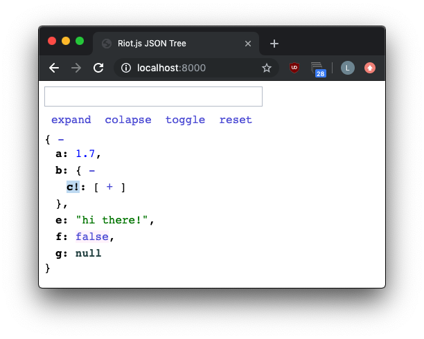

# Riot.js JSON Tree

A JSON tree renderer based on [riot.js](https://riot.js.org/) that allows customization of keys and values displayed.

## Run

```bash
python -m SimpleHTTPServer
open "http://localhost:8000/"
```

## Screenshot


